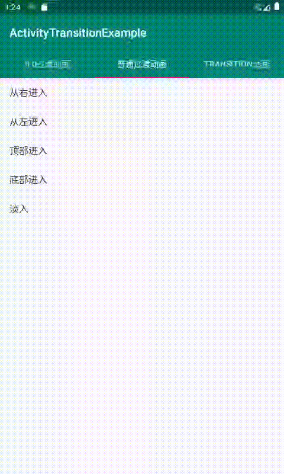
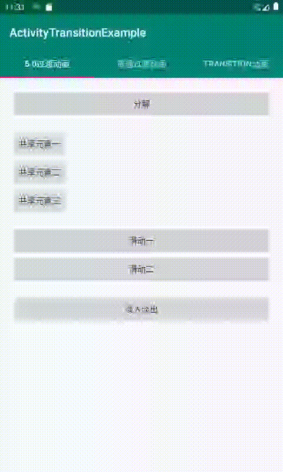
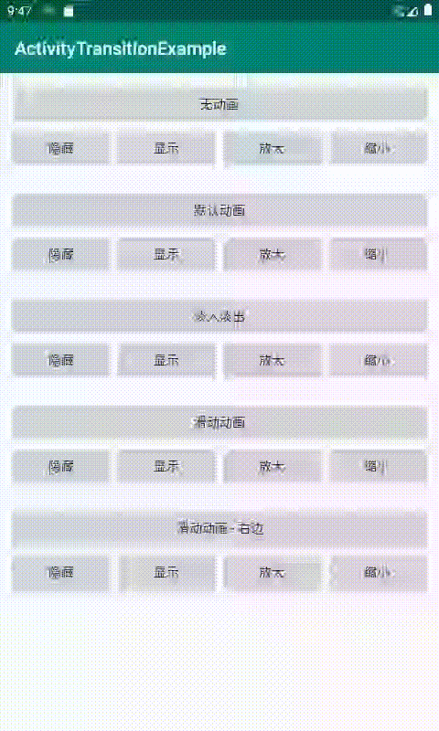

[Android动画一：Activity过渡动画详细实现原理]()
[Android动画二：5.0 实现复杂 Activity 过渡动画方式：分解动画、共享元素、滑动动画等]()
[Android动画三：使用 Transition 最简单方式实现动画]()
[Android动画四：Animator 使用教程详解]()
[Android动画五：水波纹散开效果实现]()
[Android动画六：Interpolator 实现匀速、加速、减速、抛物线速率等效果]()

### 普通Activity 转场动画

### 5.0 Activity 转场动画

### Transition 动画

